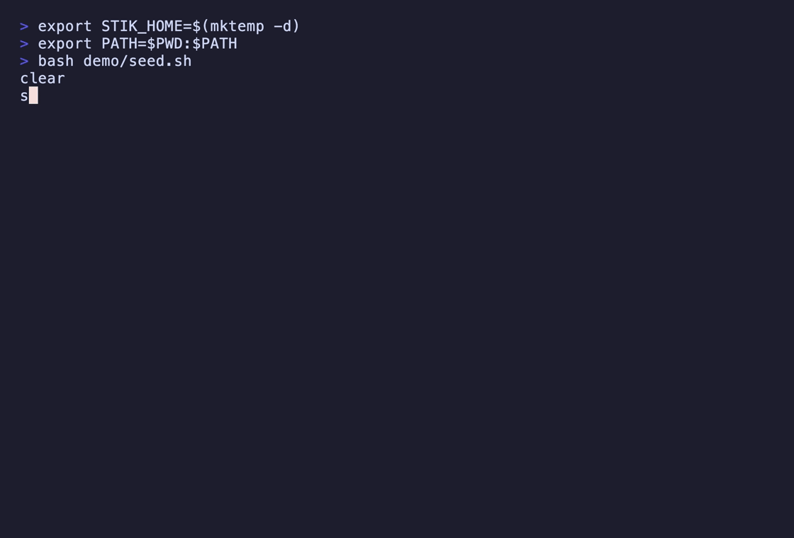

# stik

**A passive watcher that tells you, in plain English, what's on your network — and taps you on the shoulder when something new shows up.**

[](https://github.com/adamsjack711-ux/stik-cli/actions/workflows/ci.yml)
[](https://go.dev)
[](LICENSE)

<p align="center">
  
</p>

> **nmap** tells you what's on your network *right now*.
> **stik** remembers what's *normal*, and tells you when that changes.

Every other tool in this space — Wireshark, nmap, tcpdump — hands you **evidence** and leaves you to draw the conclusion. Nobody knows what `a4:83:e7:2f:11:0c` is. Everybody knows what *"Dylan's iPhone"* is. stik exists to produce that second sentence.

```
⚠ A new device joined 2 minutes ago.
  Amazon device, first seen 17:34.
  Its network-card maker is Amazon; it hasn't announced a name.
  Run `stik-net devices` to see it, or `stik-net name` to label it.
```

---

## Install

stik-net is a single Go binary. It uses `libpcap` for capture (bundled on macOS; `libpcap0.8` ships on most Linux desktops). The npm package is `stik-cli`; the installed command is **`stik-net`** (the bare `stik` name belongs to an unrelated tool).

```bash
# npm (macOS arm64, Linux x64/arm64 — ships prebuilt binaries, no toolchain needed)
npm install -g stik-cli        # installs the `stik-net` command

# from source (needs Go 1.26+ and libpcap headers) — installs a binary named `stik-net`
go install github.com/adamsjack711-ux/stik-cli/cmd/stik-net@latest

# or clone + make
git clone https://github.com/adamsjack711-ux/stik-cli
cd stik-cli && make install   # builds and installs to /usr/local/bin
```

On Debian/Ubuntu, building from source needs the pcap headers: `sudo apt install libpcap-dev`. The prebuilt Linux binaries link `libpcap` dynamically, so a runtime host needs the shared library — `sudo apt install libpcap0.8` (already present on most desktops).

Packet capture requires elevated privileges. On macOS you can grant your user access to the BPF devices once (Wireshark's *ChmodBPF* helper does this) instead of running as root; otherwise run stik-net with `sudo`.

---

## 30-second quickstart

**First run walks you through your network, one device at a time.** This is the whole idea: it builds the baseline of "normal", and it gets you to actually *look* at what's connected — usually for the first time.

```
$ stik-net

👋  Welcome to stik-net. Let's learn what's on your network.
Listening passively for 10s — stik-net only ever listens, it never sends traffic.

Found 8 devices on your network. Let's figure out what they are.

  1/8  Apple iPhone — "Dylans-iPhone"
       Its network-card maker is Apple.
       Is this yours?  [Y/n/skip] y
       name it: my phone
       ✓ saved as "my phone"

  2/8  Amazon device — no hostname
       Its network-card maker is Amazon; it hasn't announced a name.
       Is this yours?  [Y/n/skip] y
       name it: kitchen echo
       ✓ saved as "kitchen echo"
  ...
```

After that, `stik-net` is a one-line glance — and usually boring. **Boring is the feature.**

```
$ stik-net
✓ Everything looks normal. 8 known devices.
```

Leave the watcher running in the background, and you get a **desktop notification** the moment something unrecognized joins:

```bash
stik-net daemon
```

Because nobody watches a TUI all day. The alert comes to you.

### Where the alert goes

By default the daemon fires a native desktop notification. But a passive watcher's
natural home is a headless box — a Pi, a homelab server — where there's no desktop
to notify. So `stik-net daemon` can push the alert to you instead, with `--notify`
(repeatable) or the `STIK_NOTIFY` environment variable:

```bash
stik-net daemon --notify desktop                       # the default
stik-net daemon --notify ntfy://ntfy.sh/my-home-alerts # ntfy topic (phone push)
stik-net daemon --notify https://hooks.example.com/xyz # webhook: the event as JSON
stik-net daemon --notify desktop --notify ntfy://my-home-alerts   # both at once

STIK_NOTIFY="ntfy://my-home-alerts,https://hooks.example.com/xyz" stik-net daemon
```

Webhook payloads are a small JSON object, ready to route anywhere:

```json
{
  "event": "new_device",
  "mac": "a4:83:e7:9f:2c:10",
  "ip": "192.168.1.42",
  "name": "Apple iPhone",
  "vendor": "Apple, Inc.",
  "private": false,
  "first_seen": "2026-08-08T15:02:00Z",
  "interface": "en0"
}
```

The daemon also watches for two tampering signals, both urgent:

- **Rogue DHCP server** (`"event": "rogue_dhcp"`) — a host handing out leases that
  isn't your trusted router. A home network has exactly one DHCP server; a second
  is the tell of a misconfigured device or an attacker.
- **ARP spoofing** (`"event": "arp_spoof"`) — an IP address suddenly claimed by a
  different MAC while its previous owner is still active. That concurrent second
  claimant is the classic man-in-the-middle move (e.g. impersonating your gateway
  to intercept traffic). Slow, legitimate DHCP reassignment doesn't trip it —
  only a live conflict does. Still passive: stik-net never sends a probe.

---

## Commands

| Command | What it does |
|---|---|
| `stik-net` | Status: is anything new? (runs the setup wizard on first use) |
| `stik-net devices` | List every device in plain terms (`--verbose` for MACs & details) |
| `stik-net watch` | Live view; new devices highlight as they appear |
| `stik-net daemon` | Background watcher; alerts on a new device or rogue DHCP server (`--notify` for desktop / ntfy / webhook) |
| `stik-net name <who>` | Name a device — match by name, hostname, IP, or MAC |
| `stik-net forget <who>` | Remove a device from the registry |

```
$ stik-net devices
Known (4)
  • my phone (Apple iPhone)
      last seen 2 minutes ago · dylans-iphone
  • living room TV (Apple TV)
      last seen just now · apple-tv
  • work laptop (Apple MacBook)
      last seen 5 minutes ago · dylans-macbook
  • the router (TP-Link device)
      last seen just now
```

---

## What stik can — and can't — see

stik is deliberately narrow, and says so up front:

- **Passive only.** It *listens*; it never transmits. No ARP scanning, no ARP spoofing, no port scanning. This is a hard line.
- **Broadcast/multicast only.** On a switched network you physically cannot see other devices' unicast traffic — the switch doesn't forward it to your port. stik reads only the protocols every device on the LAN legitimately broadcasts: **ARP**, **mDNS** (5353), and **DHCP** (67/68).
- **For networks you own.** Point it at your own home or lab network.

That narrowness is the honest shape of the problem, not a limitation stik is hiding. See [Design notes](#design-notes) for why.

---

## How stik identifies a device

Three broadcast protocols, combined into one sentence:

- **ARP** → the MAC↔IP pairing. The ground truth of who's on the wire.
- **mDNS** → hostnames. Apple and many IoT devices announce themselves constantly (`Dylans-iPhone.local`) — free, high-quality identity.
- **DHCP** → the *set and order* of requested options is a fingerprint that often reveals the OS even when nothing else does, plus a vendor-class string like `android-dhcp-14`.
- **OUI** → the first three bytes of the MAC map to a manufacturer, via the **embedded IEEE registry** (no network fetch — stik works on a network it doesn't trust).

Then it writes the verdict: *"Apple iPhone"*, *"Amazon device"*, *"unknown device (Espressif — likely IoT)"*, or — when a phone is using a randomized address — *"device with a private address"*.

---

## Design notes

The interesting decisions, and why they went the way they did.

### Verdicts, not packets

The prime directive: **output the conclusion, not the evidence.** A tool that prints `unrecognized OUI a4:83:e7` has made the human do the work. stik prints *"a device we don't recognize."* Raw MACs, IPs, and DHCP fingerprints exist, but they live behind `--verbose`. If a design choice makes the output more technically complete but less humanly legible, it's the wrong choice.

### Passive, and broadcast-only — the limit stik refuses to cross

On a switched network, one host cannot see another host's unicast traffic; the switch simply doesn't deliver it. The only ways around that are **port mirroring** (needs switch access you usually don't have) or **ARP spoofing** — telling every device you're the router so their traffic flows through you. Spoofing is an *attack* technique. stik will not do it.

So stik confines itself to what any device on the LAN can legitimately hear: broadcast and multicast. That's a real limit, and stik states it plainly rather than overclaiming. Explaining the boundary you *chose not to cross* is the honest way to build a tool like this.

### Why DHCP option ordering fingerprints an OS

When a device joins a network it sends a DHCP request containing a **Parameter Request List** (option 55): the specific options it wants, *in a specific order*. That order is baked into each OS's DHCP client and barely changes between versions — so `1,3,6,15,26,28,51,58,59,43` says "Android" and `1,121,3,6,15,119,252,95,44,46` says "Apple". stik preserves the order exactly, because the order is the signal. (Option 60, the vendor class, is an even more direct hint when a device sends one.)

### Randomized MACs, and why naive vendor lookup lies

Modern phones rotate their MAC address per network to resist tracking. A randomized MAC has an invented prefix, so an OUI lookup will either fail or — worse — *coincidentally match some real vendor and confidently report the wrong thing.* stik checks the **locally-administered bit** (`0x02` of the first octet) first. If it's set, stik doesn't trust the OUI at all and says *"device with a private address"* — unless mDNS gave a real name, in which case the name wins. Getting this right is the difference between a demo and a tool.

### One storage module

Everything stik persists lives in a single JSON file (`~/.stik/devices.json`), and exactly one package (`internal/store`) ever touches it. Writes are **atomic** — a sibling temp file is written and then `rename`d over the target — so a crash or a second process can never leave a half-written, unparseable registry behind. A corrupt file is backed up and the registry starts fresh rather than wedging the tool. The store's interface is tiny on purpose: a SQLite backend could replace it without a single command changing.

### Embedded OUI table, no runtime fetch

The IEEE manufacturer database (~40,000 prefixes) is compressed and embedded in the binary at build time. stik never phones home to identify a device — which matters, because you might be pointing it at a network you don't trust.

---

## Development

```bash
make build      # build ./stik
make test       # go test ./...
make vet        # go vet
make oui        # regenerate the embedded IEEE OUI table
```

The dissectors are tested against **real serialized packet bytes** (ARP, mDNS, DHCP) rather than mocks — the same frames libpcap would hand them. Lane-free logic like OUI lookup, randomized-MAC detection, known-vs-new, atomic writes, and corrupt-store recovery all have focused unit tests.

Record the demo GIF with [vhs](https://github.com/charmbracelet/vhs):

```bash
bash demo/record.sh
```

## License

MIT — see [LICENSE](LICENSE). Built for networks you own.
